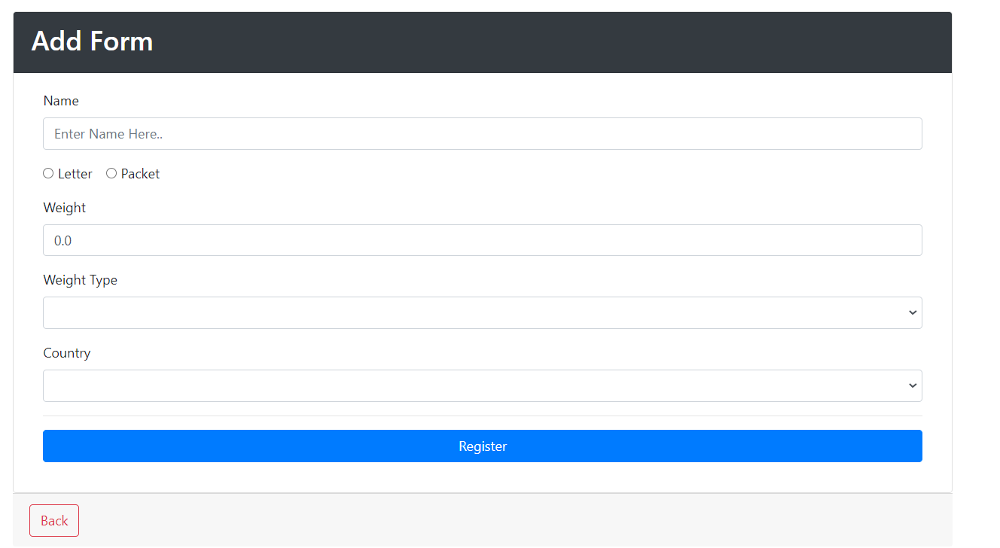
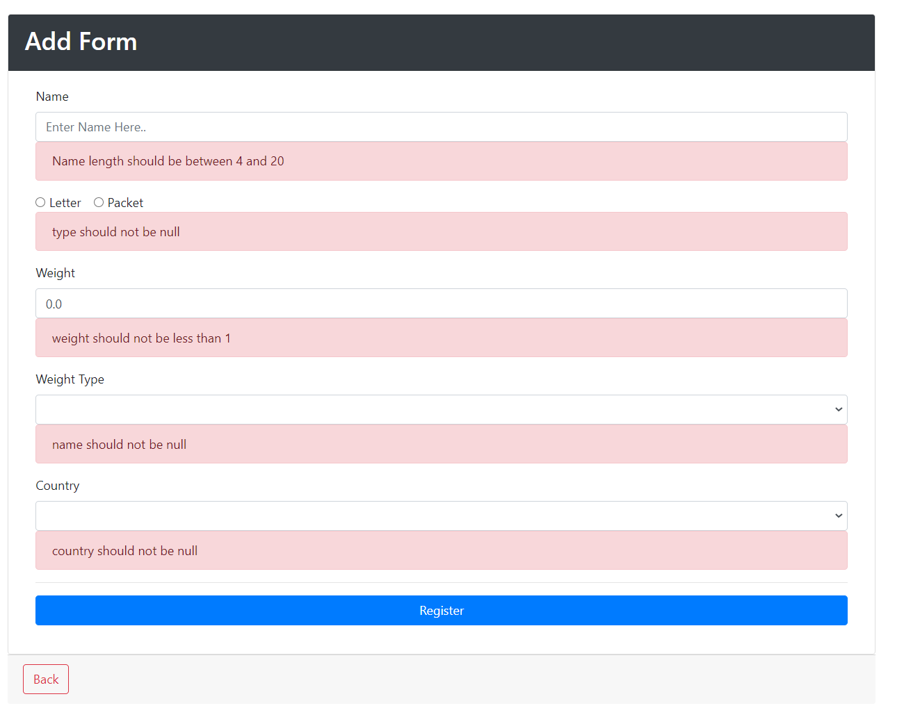
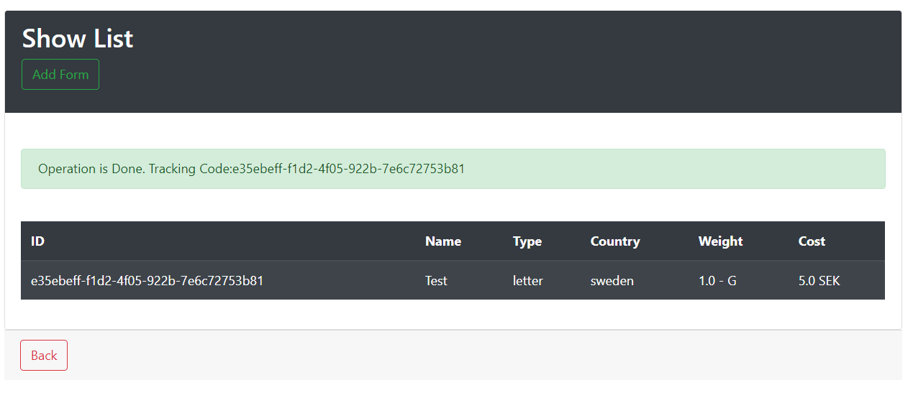

# Shipping Cost Calculating App
## App Pages
1. AddBoxForm
2. ShowBoxList
   
### Frameworks:
- Spring Boot Dev Tools
- Spring Boot Web
- Spring Data JPA
- Validation
- Thymeleaf
- MySql
- H2
- bootstrap
- Unit test

#### Functionalities:
- Implement CRUD Operations
- Implement Validation for AddBoxForm
- Calculate shipping cost
    - Country Multipliers
        - Sweden: 2.5
        - Australia: 7
    - Weight Type
        - KG: 1000 SEK
        - G: 2 SEK
- Optional: Implement **Exception Handling**


## Classes
- ShippingController
- BoxRepository
- Box

###### Class Variables
Class Name:  Box
```
String id;
String name;
String country;
String type;
double cost;
double weight;
String weightType;
LocalDateTime createDate;
boolean status;
```


### Add Form

### Validation Add Form

### Show List

